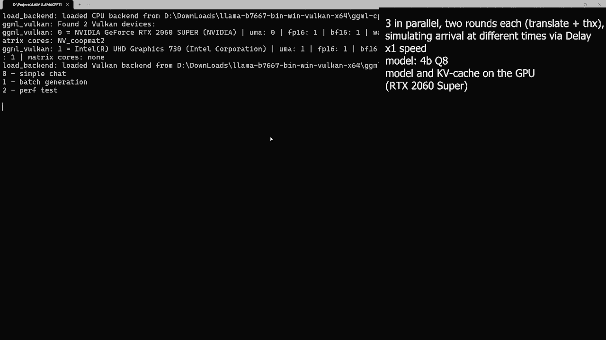
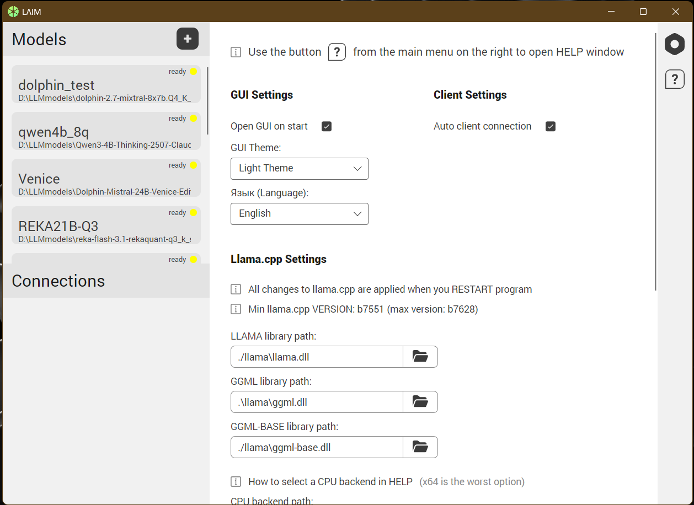
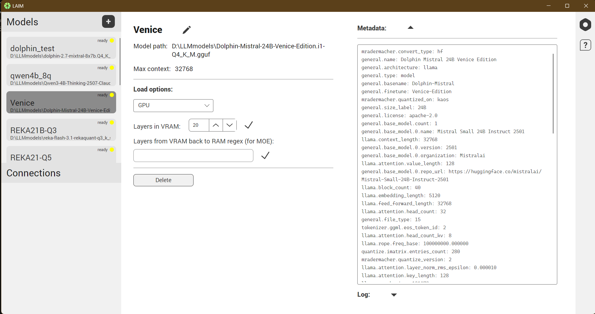

<p align="center">
  
</p>

[RU-версия README](./README_RU.md)

# llama.csharp

**llama.csharp** is a .NET wrapper library for [llama.cpp](https://github.com/ggml-org/llama.cpp) that provides batch processing (Continuous batching) and context sequence cache management.

The project's Telegram group — [Local AI Models](https://t.me/+5u17pJAAlSJlN2Zi) — for receiving update notifications, discussions, questions, usage examples, etc. It is also a shared group for all projects implemented by me (and possibly not only by me in the future) based on this library.

## Usage example

For a simple chat *(slightly shortened code)*

```csharp
var requiredFiles = new[] { *paths to engine files*};

// Initialize the library
LlamaCpp.Initialize(requiredFiles[0],
                    requiredFiles[1],
                    requiredFiles[2],
                    [requiredFiles[3]]);
// Load the model
ModelParams parametres = new ModelParams(_modelPath) 
{
    //GpuLayerCount = 999, // Can be set when using GPU
    //TensorBufferOverrides = [new TensorBufferOverride("blk\\.[0-35].*exps.*", "CPU")], // If using GPU, for MOE models you can offload experts to CPU. In this example for layers 0-35
    //TensorBufferOverrides = [new TensorBufferOverride(".*exps.*", "CPU")], // Here all experts
    //... other settings (see documentation for details)
};
LLamaWeights model = LLamaWeights.LoadFromFile(parametres);

// Create an executor for working with context
ContextParams ctxParams = new ContextParams()
{
    ContextSize = 16000,
    //SeqMax = 1, // number of sequences available to create, default is already one
    //NoKqvOffload = false // If using GPU and enough VRAM, you can offload the context to GPU
    //... other settings (see documentation for details)
};
LlamaExecutor executor = model.CreateExecutor(ctxParams);

// Create a sequence (one is enough for a simple chat)
LLamaSeqId mainSeq = await executor.CreateSequence();

// The message that will be loaded into the sequence context. Contains arbitrarily placed role tags
string startPrefill = "<system>\r\nYou are an expert translator. Before translating, you must analyze the input in a <think> block.\r\n</system>\r\n" +
    "<user>\r\n今天天气不错，我们去公园散步吧\r\n</user>\r\n" +
    "<assistant>\r\n<think>\r\nThe input is a casual Chinese sentence. " +
    "Breaking it down: 今天 (today), 天气 (weather), 不错 (not bad / pretty good), 我们 (we), 去 (go), 公园 (park), 散步 (take a walk / stroll), 吧 (suggestion particle). " +
    "The overall tone is friendly and suggestive. A natural English equivalent should maintain this casual, inviting tone.\r\n</think>\r\n" +
    "The weather is nice today, let's go for a walk in the park.\r\n</assistant>\r\n" +
    "<user>\r\n请把这份文件翻译成英文，注意保持正式语气\r\n</user>\r\n" +
    "<assistant>\r\n<think>\r\nThe user is asking to translate a document, but no document has been provided yet. " +
    "The instruction itself is in Chinese: 请 (please), 把这份文件 (this document), 翻译成英文 (translate into English), 注意保持正式语气 (pay attention to maintaining a formal tone). " +
    "Since the user only provided the instruction and not the actual document, I should acknowledge the request and ask for the document text.\r\n</think>\r\n" +
    "Please share the document text you would like me to translate, and I will ensure a formal tone in the English version.\r\n</assistant>";
// you can add the model's EOS token after '</assistant>', obtained from model.Vocab.LLamaTokenToString(model.Vocab.EOS, true) if needed

// Fill the sequence context. No tokens are added to the input internally, only BOS if set in the third argument (default false)
await executor.ProcessPrompt(mainSeq, startPrefill, model.Vocab.ShouldAddBOS);

Console.WriteLine(startPrefill);

// Inference parameters
InferenceParams inferenceParams = new InferenceParams()
{
    MaxTokens = -1,
    AutoStopFromEOG = true,
    DecodeSpecialTokens = true,
    AntiPrompts = ["</assistant>"],
    SamplingPipeline = new TunableSamplerPipeline(
        new TunableSamplerPipelineSettings(
            [
                // List of samplers in order of application to logits
                new TopKSampler() { K=30 }
            ],
            // Finalizing sampler: Greedy, Distribution, or Mirostat2
            new Mirostat2Sampler() { Seed = 256}
        )
    )
};

string input = "";

// Chat loop
while (true)
{
    Console.Write("Me: "); // not sent to the model, visual
    *getting input, checking for loop exit*

    // Text to be sent to the sequence context
    string prefillInput = "\r\n<user> " + input + " </user>\r\n<assistant>\r\n<think>";

    Console.Write("\r\nNot me):\r\n<think>"); // not sent to the model, visual

    // Fill user input into the sequence context
    await executor.ProcessPrompt(mainSeq, prefillInput);

    // Get the generation channel for the sequence, pass only its id and inference parameters
    Channel<string> ch = await executor.Generate(mainSeq, inferenceParams);

    await foreach (string token in ch.Reader.ReadAllAsync())
    {
        Console.Write(token); // Print tokens converted to strings
    }
}

executor.Dispose(); // Release the executor
model.Dispose(); // and the model
```
For batch generation with a shared prefix *(significantly shortened code)*

```csharp
    LlamaCpp.Initialize(...);
    ModelParams parametres = new ModelParams(_modelPath) {...};
    LLamaWeights model = LLamaWeights.LoadFromFile(parametres);

    ContextParams ctxParams = new ContextParams()
    {
        ContextSize = 16000,
        SeqMax = 3 // set maximum three sequences
    };
    LlamaExecutor executor = model.CreateExecutor(ctxParams);

    // Create three sequences for batch translation of three texts
    LLamaSeqId seq1 = await executor.CreateSequence();
    LLamaSeqId seq2 = await executor.CreateSequence();
    LLamaSeqId seq3 = await executor.CreateSequence();

    string startPrefill = *same as above*;

    // Fill one of the sequences with the starting prefix (any one)
    await executor.ProcessPrompt(seq1, startPrefill, model.Vocab.ShouldAddBOS);

    // Get the position of the next token for the filled sequence
    LLamaPos endPos = await executor.GetSequenceNextDecodedTokenPos(seq1);

    // Share the cache of seq1 with seq2 and seq3 up to the specified sequence position
    await executor.CopySeqPrefixTo(seq1, [seq2, seq3], endPos);

    Console.WriteLine(startPrefill);

    // Data of the three generation streams for display
    var contexts = new ConcurrentDictionary<LLamaSeqId, string>()
    {
        [seq1] = "",
        [seq2] = "",
        [seq3] = ""
    };

    // Three texts for translation
    List<string> queries = [
        "🔬 模块一：量子计算：超越经典的新范式\n传统计算机以“比特”（0或1）为信息基本单位，而量子计算机利用“量子比特”的叠加态与量子纠缠特性，可在同一时刻探索海量计算路径。近年来，谷歌、IBM与中国科研团队相继实现“量子优越性”，在特定算法任务上显著超越经典超算。尽管量子纠错、相干时间与规模化集成仍是技术瓶颈，但量子计算有望在密码破译、新药分子模拟与高温超导材料设计中实现突破性应用。\n📌 核心提示：量子并行性是算力跃迁的关键，工程化落地仍需跨学科协同攻关。",
        "🧬 模块二：CRISPR-Cas9：精准改写生命密码\nCRISPR-Cas9是一种源自细菌适应性免疫系统的基因编辑工具，够像“分子剪刀”般在目标DNA位点进行精准切割与修复。自2012年技术成熟以来，它已广泛应用于作物抗病育种、遗病机制解析与肿瘤免疫治疗。2023年底，全球首款基于CRISPR的镰状细胞病基因疗法正式获批，标志着基因医学从验室走向临床。当前研究重点在于提升编辑特异性、降低脱靶效应，并探索体内递送系统的安全边界。\n📌 核心示：技术已进入临床转化期，伦理监管与长期安全性评估需同步完善。",
        "🤖 模块五：AI赋能科研：从AlphaFold到科学大模型\n人工智能正推动科学研究范式向“数据驱动+智能推演”转型DeepMind的AlphaFold成功预测超2亿种蛋白质三维结构，将结构生物学研究效率提升数个数量级。如今，面向材料选、气候模拟、催化反应与药物设计的科学大模型可自动解析文献、生成可验证假设并优化实验路径。AI并非替代科家，而是作为“高通量协作者”压缩试错周期，加速跨学科知识融合。\n📌 核心提示：人机协同科研已成常态，模型解释性与科学因果推断是下一阶段重点。"
    ];

    // generation tasks simulating arrival at different times via Delay, also containing one additional user query each after translation completes
    Task gen1 = GenerateAsync(executor, seq1, queries[0], contexts, 3000);
    Task gen2 = GenerateAsync(executor, seq2, queries[1], contexts, 1500);
    Task gen3 = GenerateAsync(executor, seq3, queries[2], contexts, 0);

    List<Task> tasks = [gen1, gen2, gen3];

    *Table from Spectre.Console for displaying the generation of three texts simultaneously*
}

// Method for generating two rounds with a delay
static async Task GenerateAsync(
    LlamaExecutor executor,
    LLamaSeqId seqId,
    string text, // Chinese text for translation
    ConcurrentDictionary<LLamaSeqId, string> contexts,
    int delay)
{
    // Inference parameters
    InferenceParams inferenceParams = new InferenceParams() {*same ...*};

    List<string> queries = new List<string>();
    queries.Add(text);
    queries.Add("thanks"); // add a second query

    string input = queries[0];

    // chat of two queries: translation and thanks
    foreach (var query in queries)
    {
        // simulate queries arriving at different times
        await Task.Delay(delay);

        string prefillInput = "\r\n<user> " + query + "</user> \r\n <assistant> <think>";
        contexts[seqId] += prefillInput; // for display in the table

        await executor.ProcessPrompt(seqId, prefillInput, false, true);

        await foreach (string token in (await executor.Generate(seqId, inferenceParams)).Reader.ReadAllAsync())
        {
            contexts[seqId] += token;  // for display in the table
        }
    }

}
```

Work with sequences can be performed independently (although there are also functions for working with a batch of sequences at once), each can be individually filled with an input and generation can be launched separately for each, while the **batch** for model processing is assembled at each processing step (the `DecodingLoop()` method of `LlamaExecutor`) **from the currently available generation and filling tasks** of one executor (some call this Continuous Batching).

**Sequences can share KV-cache cells among themselves** (usually the beginning of the sequence for GPT). When using `CopySeqPrefixTo`, the sequence to which the cache is shared is completely cleared and begins to reference a chunk of the cache of another sequence (this also saves context cache: if three sequences of 2000 tokens each share 1500 common ones, then the actual cache used is only 1500 + 3*500 = 3000 instead of 6000). After sharing the cache, sequences can still be processed independently; deleting one of the sequences will not clear the shared cache (the cache is cleared when no one references it).

More details in the [documentation](./doc/PublicDoc_EN.md).

<p align="center">
  
</p>

Full example code can be found in the **test_program** subproject of the repository in the methods `SimpleChat` and `BatchGenerator`. There are also other examples and more will be added.

## Public API Documentation
[Documentation](./doc/PublicDoc_EN.md) contains a description of the functions of the main class for working with model contexts (`LlamaExecutor`) and other data necessary for their use.

The integration tests in the **IntegrationTest** subproject provide additional usage examples and verify that sequence state remains consistent under intentionally unusual usage scenarios.

## Adding to a project
The source files of the library, without test and example subprojects, with support for the required set of llama.cpp versions, can be downloaded as an archive from [releases](https://github.com/stmay4/llama.csharp/releases).

The engine files needed to initialize the library in code can be downloaded from the official [releases](https://github.com/ggml-org/llama.cpp/releases) of the llama.cpp project and specified in the initialization method (details in the [documentation](./doc/PublicDoc_EN.md)).

```csharp
// Library initialization (loading the engine and binding functions)
LlamaCpp.Initialize(
    "./llama/llama.dll", 
    "./llama/ggml.dll", 
    "./llama/ggml-base.dll",
    [ // In this case, backends are loaded: CPU and Vulkan GPU
        "./llama/ggml-cpu-alderlake.dll",
        "./llama/ggml-vulkan.dll"
    ]
);
```

The library is written using .NET 8

Dependencies:<br>
PackageReference Include="CommunityToolkit.HighPerformance" Version="8.4.0" with its SpanOwner (may be replaced with ArrayPool<T>.Shared from System)

## Plans

- Keep up to date with the latest llama.cpp releases
- Support for multimodal LLMs (audio and images): functions for tokenizing multimodal input and filling the context with such tokens
- Adding an embeddings retrieval function (possibly, if a flag is set to true, obtaining them together with logits — needs further thought)
- Support for saving sequence states (and context state in general?) to enable offloading part of the sequences to memory at runtime when context cache is insufficient
- Support for speculative decoding (MTP, eagle, etc.)
- Support for LoRA adapters (for now, adapters can be merged into the model)

## Projects
Projects using the library:

---

*(the repository is currently private, preparation for opening is in progress)*<br>
  [**LAIM**](https://github.com/stmay4/LAIM) <br>
Local server that provides programs on the computer with access to a GUI-configured list of LLMs via a low-level stateful API over named pipes, with functions for direct work with contexts and sequences from this library.<br>The project offers a ready-made integration library, Laim.Client, for the .NET platform.<br>A desktop GUI application for direct work with models — LAIMCHAT — is also under development.

<p align="center">
  
  
</p>

Problems solved: duplication of models in memory when loading the same one in different programs, separate configuration of model loading parameters in each program, and the lack of direct client interaction with context and batch processing in popular alternatives.

---

To add your own projects to this section, write in Issues, send an email to stasmayorov2004@mail.ru, or post in the Telegram group under the topic Projects-Discussion.

## Thanks
The project structure is based on [LlamaSharp](https://github.com/SciSharp/LLamaSharp).<br>
Documentation and source code from [llama.cpp](https://github.com/ggml-org/llama.cpp) are used for development; release builds of [llama.cpp](https://github.com/ggml-org/llama.cpp) are used for running LLMs in production.