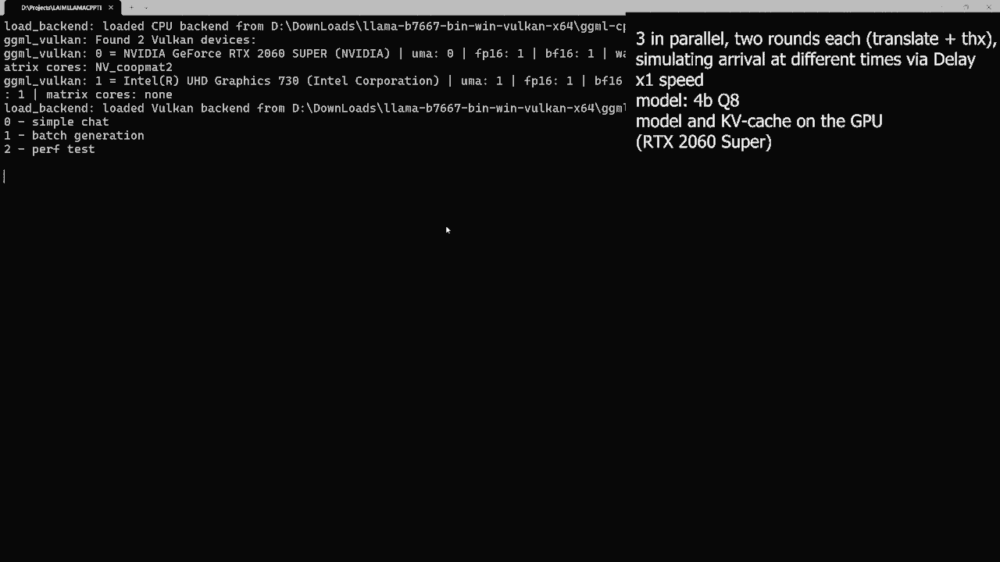
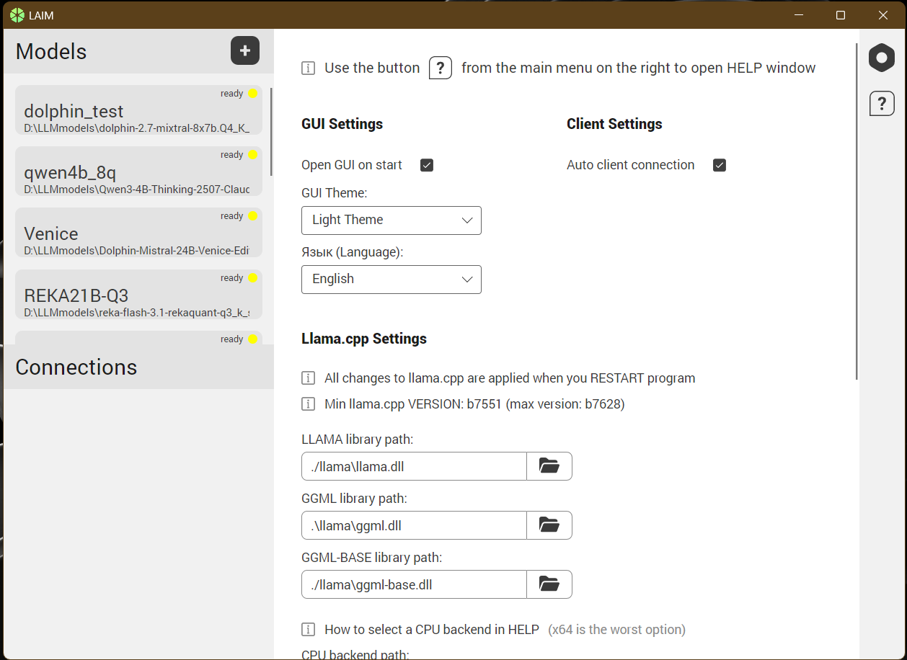
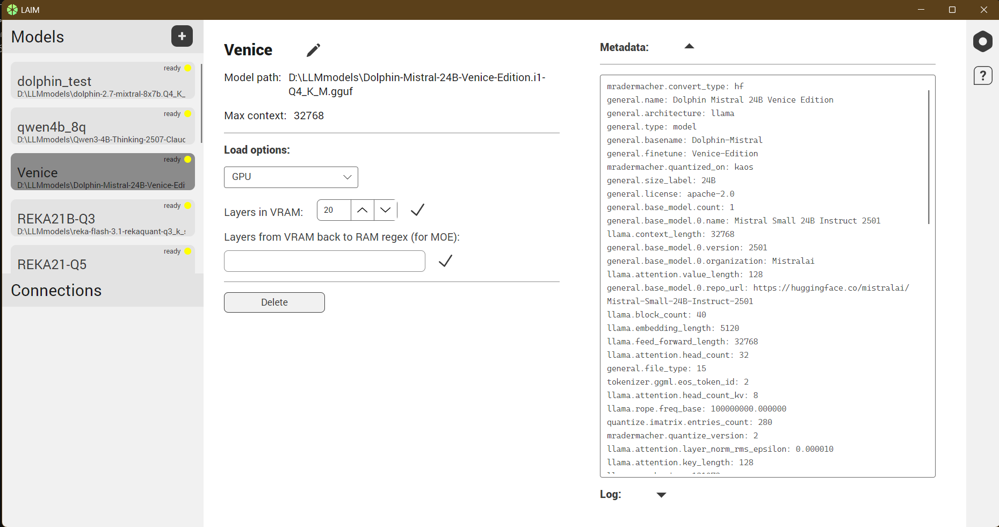

<p align="center">
  
</p>

# llama.csharp

**llama.csharp** is a wrapper library over [llama.cpp](https://github.com/ggml-org/llama.cpp) for .NET, providing batch processing (Continuous batching) and work with sequence context cache.

Project Telegram group - [Local AI Models](https://t.me/+5u17pJAAlSJlN2Zi) for receiving update notifications, communication, questions, usage examples, etc. It is also a common group with all projects implemented by me (and maybe in the future not only by me) based on this library.

## What is it for?
A wrapper over the sequence cache from llama.cpp for manual control of batch processing. It can be useful when working simultaneously with many long contexts, or for controlled sharing of the beginning of a context.

Slots do the work automatically. Here you allocate sequences, split them, clear them (and in future updates dump them to disk) under the control of your code.

## Usage example

For a simple chat *(slightly shortened code)*

```csharp
var requiredFiles = new[] { *paths to engine files*};

// Library initialization
LlamaCpp.Initialize(requiredFiles[0],
                    requiredFiles[1],
                    requiredFiles[2],
                    [requiredFiles[3]]);
// Load model
ModelParams parametres = new ModelParams(_modelPath) 
{
    //GpuLayerCount = 999, // Can be set when using GPU
    //TensorBufferOverrides = [new TensorBufferOverride("blk\\.[0-35].*exps.*", "CPU")], // If GPU is used, for MoE models you can offload experts to CPU. In this example for layers 0-35
    //TensorBufferOverrides = [new TensorBufferOverride(".*exps.*", "CPU")], // Here all experts
    //... other settings (see documentation for details)
};
LLamaWeights model = LLamaWeights.LoadFromFile(parametres);

// Create an executor for working with context
ContextParams ctxParams = new ContextParams()
{
    ContextSize = 16000,
    //SeqMax = 1, // number of sequences available for creation; by default there is one anyway
    //NoKqvOffload = false // If GPU is used and there is enough VRAM, you can offload the context to GPU
    //... other settings (see documentation for details)
};
LlamaExecutor executor = model.CreateExecutor(ctxParams);

// Create a sequence (for a simple chat one is enough)
LLamaSeqId mainSeq = await executor.CreateSequence();

// Message that will be loaded into the sequence context. Contains arbitrarily placed role tags
string startPrefill = "<system>\r\nYou are an expert translator. Before translating, you must analyze the input in a <think> block.\r\n</system>\r\n" +
    "<user>\r\n今天天气不错，我们去公园散步吧\r\n</user>\r\n" +
    "<assistant>\r\n<think>\r\nThe input is a casual Chinese sentence. " +
    "Breaking it down: 今天 (today), 天气 (weather), 不错 (not bad / pretty good), 我们 (we), 去 (go), 公园 (park), 散步 (take a walk / stroll), 吧 (suggestion particle). " +
    "The overall tone is friendly and suggestive. A natural English equivalent should maintain this casual, inviting tone.\r\n</think>\r\n" +
    "The weather is nice today, let's go for a walk in the park.\r\n</assistant>\r\n" +
    "<user>\r\n请把这份文件翻译成英文，注意保持正式语气\r\n</user>\r\n" +
    "<assistant>\r\n<think>\r\nThe user is asking to translate a document, but no document has been provided yet. " +
    "The instruction itself is in Chinese: 请 (please), 把这份文件 (this document), 翻译成英文 (translate into English), 注意保持正式语气 (pay attention to maintaining a formal tone). " +
    "Since the user only provided the instruction and not the actual document, I should acknowledge the request and ask for the document text.\r\n</think>\r\n" +
    "Please share the document text you would like me to translate, and I will ensure a formal tone in the English version.\r\n</assistant>";
// you can add after '</assistant>' the model EOS token obtained from model.Vocab.LLamaTokenToString(model.Vocab.EOS, true) if necessary

// Fill the sequence context. No tokens are added to the input inside, only BOS if set in the third argument (default false)
await executor.ProcessPrompt(mainSeq, startPrefill, model.Vocab.ShouldAddBOS);

Console.WriteLine(startPrefill);

// Generation parameters
InferenceParams inferenceParams = new InferenceParams()
{
    MaxTokens = -1,
    AutoStopFromEOG = true,
    DecodeSpecialTokens = true,
    AntiPrompts = ["</assistant>"],
    SamplingPipeline = new TunableSamplerPipeline(
        new TunableSamplerPipelineSettings(
            [
                // List of samplers in order of application to logits
                new TopKSampler() { K=30 }
            ],
            // Finalizing sampler: Greedy, Distribution or Mirostat2
            new Mirostat2Sampler() { Seed = 256}
        )
    )
};

string input = "";

// Chat loop
while (true)
{
    Console.Write("Me: "); // not sent to model, visual only
    *getting input, checking for loop exit*

    // Text sent to sequence context
    string prefillInput = "\r\n<user> " + input + " </user>\r\n<assistant>\r\n<think>";

    Console.Write("\r\nNot me):\r\n<think>"); // not sent to model, visual only

    // Fill user input into sequence context
    await executor.ProcessPrompt(mainSeq, prefillInput);

    // Get generation channel for the sequence, pass only its id and generation parameters
    Channel<string> ch = await executor.Generate(mainSeq, inferenceParams);

    await foreach (string token in ch.Reader.ReadAllAsync())
    {
        Console.Write(token); // Print tokens converted to strings
    }
}

executor.Dispose(); // Dispose executor
model.Dispose(); // and model
```

For batch generation by a common prefix (greatly shortened code)

```csharp
    LlamaCpp.Initialize(...);
    ModelParams parametres = new ModelParams(_modelPath) {...};
    LLamaWeights model = LLamaWeights.LoadFromFile(parametres);

    ContextParams ctxParams = new ContextParams()
    {
        ContextSize = 16000,
        SeqMax = 3 // set maximum three sequences
    };
    LlamaExecutor executor = model.CreateExecutor(ctxParams);

    // Create three sequences for batch translation of three texts
    LLamaSeqId seq1 = await executor.CreateSequence();
    LLamaSeqId seq2 = await executor.CreateSequence();
    LLamaSeqId seq3 = await executor.CreateSequence();

    string startPrefill = *same as above*;

    // Fill one of the sequences with the start prefill (any)
    await executor.ProcessPrompt(seq1, startPrefill, model.Vocab.ShouldAddBOS);

    // Get the next token position for the filled sequence
    LLamaPos endPos = await executor.GetSequenceNextDecodedTokenPos(seq1);

    // Split seq1 cache with seq2 and seq3 up to the specified sequence position
    await executor.CopySeqPrefixTo(seq1, [seq2, seq3], endPos);

    Console.WriteLine(startPrefill);

    // Data of three generation streams for display
    var contexts = new ConcurrentDictionary<LLamaSeqId, string>()
    {
        [seq1] = "",
        [seq2] = "",
        [seq3] = ""
    };

    // Three texts for translation
    List<string> queries = [
        "🔬 模块一：量子计算：超越经典的新范式\n传统计算机以“比特”（0或1）为信息基本单位，而量子计算机利用“量子比特”的叠加态与量子纠缠特性，可在同一时刻探索海量计算路径。近年来，谷歌、IBM与中国科研团队相继实现“量子优越性”，在特定算法任务上显著超越经典超算。尽管量子纠错、相干时间与规模化集成仍是技术瓶颈，但量子计算有望在密码破译、新药分子模拟与高温超导材料设计中实现突破性应用。\n📌 核心提示：量子并行性是算力跃迁的关键，工程化落地仍需跨学科协同攻关。",
        "🧬 模块二：CRISPR-Cas9：精准改写生命密码\nCRISPR-Cas9是一种源自细菌适应性免疫系统的基因编辑工具，够像“分子剪刀”般在目标DNA位点进行精准切割与修复。自2012年技术成熟以来，它已广泛应用于作物抗病育种、遗病机制解析与肿瘤免疫治疗。2023年底，全球首款基于CRISPR的镰状细胞病基因疗法正式获批，标志着基因医学从验室走向临床。当前研究重点在于提升编辑特异性、降低脱靶效应，并探索体内递送系统的安全边界。\n📌 核心示：技术已进入临床转化期，伦理监管与长期安全性评估需同步完善。",
        "🤖 模块五：AI赋能科研：从AlphaFold到科学大模型\n人工智能正推动科学研究范式向“数据驱动+智能推演”转型DeepMind的AlphaFold成功预测超2亿种蛋白质三维结构，将结构生物学研究效率提升数个数量级。如今，面向材料选、气候模拟、催化反应与药物设计的科学大模型可自动解析文献、生成可验证假设并优化实验路径。AI并非替代科家，而是作为“高通量协作者”压缩试错周期，加速跨学科知识融合。\n📌 核心提示：人机协同科研已成常态，模型解释性与科学因果推断是下一阶段重点。"
    ];

    // generation tasks with simulated arrival at different times via Delay, also contain one more user request after translation completes
    Task gen1 = GenerateAsync(executor, seq1, queries[0], contexts, 3000);
    Task gen2 = GenerateAsync(executor, seq2, queries[1], contexts, 1500);
    Task gen3 = GenerateAsync(executor, seq3, queries[2], contexts, 0);

    List<Task> tasks = [gen1, gen2, gen3];

    *Spectre.Console table for displaying generation of three texts simultaneously*
}

// Method for generating two rounds with delay
static async Task GenerateAsync(
    LlamaExecutor executor,
    LLamaSeqId seqId,
    string text, // text in Chinese for translation
    ConcurrentDictionary<LLamaSeqId, string> contexts,
    int delay)
{
    // Generation parameters
    InferenceParams inferenceParams = new InferenceParams() {*same ...*};

    List<string> queries = new List<string>();
    queries.Add(text);
    queries.Add("thanks"); // add second request

    string input = queries[0];

    // chat of two requests: translation and thanks
    foreach (var query in queries)
    {
        // simulate requests arriving at different times
        await Task.Delay(delay);

        string prefillInput = "\r\n<user> " + query + "</user> \r\n <assistant> <think>";
        contexts[seqId] += prefillInput; // for display in table

        await executor.ProcessPrompt(seqId, prefillInput, false, true);

        await foreach (string token in (await executor.Generate(seqId, inferenceParams)).Reader.ReadAllAsync())
        {
            contexts[seqId] += token;  // for display in table
        }
    }

}
```

Work with sequences can happen separately (although there are also functions for working with a batch of sequences at once); you can enter prefill into each separately and start generation separately for each, while the **batch** for model processing is assembled at each processing step (the DecodingLoop() method of LlamaExecutor) **from the generation and fill tasks currently available** of one executor (some call this Continuous Batching).

**Sequences can share KV cache cells of the context** (usually the beginning of the sequence for GPT). When using CopySeqPrefixTo, the sequence into which we split the cache is completely cleared and begins to reference a piece of another sequence's cache (this also saves context cache: if three sequences of 2000 tokens share 1500 common ones, then only 1500 + 3*500 = 3000 cache is actually occupied instead of 6000). After splitting the cache, sequences can also be processed separately; deleting one of the sequences will not clear the shared cache (the cache will be cleared when no one references it).

More details in [documentation](./doc/PublicDoc_RU.md).

<p align="center">
  
</p>

Full example code is in the **test_program** subproject of the repository in the SimpleChat and BatchGenerator methods. There are also other examples there, and more will be added.

## Public interface documentation
[Documentation](./doc/PublicDoc_RU.md) contains a description of the functions of the main class for working with model contexts, LlamaExecutor, and other data needed to use them.

In the integration tests of the **IntegrationTest** subproject there are additional examples of usage and checks for breaking sequence state under deliberately strange usage scenarios.

## Adding to a project
The library source files without test and example subprojects, with support for the required list of llama.cpp versions, can be downloaded as an archive from [releases](https://github.com/stmay4/llama.csharp/releases).

The engine files for initializing the library in code can be downloaded from the official [releases](https://github.com/ggml-org/llama.cpp/releases) of the llama.cpp project and specified in the init method (see [documentation](./doc/PublicDoc_RU.md) for details).

```csharp
// Library initialization (loading engine and binding functions)
LlamaCpp.Initialize(
    "./llama/llama.dll", 
    "./llama/ggml.dll", 
    "./llama/ggml-base.dll",
    [ // In this case the backends loaded are: CPU and Vulkan GPU
        "./llama/ggml-cpu-alderlake.dll",
        "./llama/ggml-vulkan.dll"
    ],
    "./llama/mtmd.dll" // optional, for multimodal
);
```

The library is written using .NET 10 (previous versions 1.3.1 and below use .NET 8)

Dependencies:<br>
"CommunityToolkit.HighPerformance" Version="8.4.0"

For multimodal since 1.4.0, the following were added:<br>
"NAudio.Core" Version="3.0.1"<br>
"SixLabors.ImageSharp" Version="2.1.13"<br>


## Plans

- Update to the latest versions of llama.cpp (sometimes ✅)
- Support for multimodal LLMs (audio and images) ✅ (video still needs to be added)
- Add embedding retrieval function (possibly, if a flag is set to true, retrieve together with logits - to think about) 
- Support for saving sequence states (and context as a whole?) to be able to offload part of sequences to memory during operation when context cache is insufficient
- Support for speculative decoding (MTP, eagle, etc.)
- Support for LoRA adapters (for now adapters can be merged into the model) 

## Projects
Projects using the library:

---

*(currently the repository is private, pending)*<br>
  [**LAIM**](https://github.com/stmay4/LAIM) <br>
Local server for providing programs on the computer with access to a GUI-defined list of LLMs via a low-level stateful API over named channels with functions for direct work with context and sequences from this library.<br>The project offers a ready-made integration library Laim.Client for the .NET platform<br>Also in development is a desktop GUI program for direct work with models - LAIMCHAT

<p align="center">
  
  
</p>

Problems solved: duplication of models in memory when loading the same one in different programs, separate configuration of model loading parameters in each program, lack of direct client work with context and batch processing in popular analogues 

---

To add your projects to this section, write in Issues or to stasmayorov2004@mail.ru or in the Telegram group in the Projects-discussion topic.

## Thanks
The project structure is taken from [LlamaSharp](https://github.com/SciSharp/LLamaSharp).<br>
For development, the documentation and source code of [llama.cpp](https://github.com/ggml-org/llama.cpp) are used; for working with LLMs in operation, release builds of [llama.cpp](https://github.com/ggml-org/llama.cpp) are used.